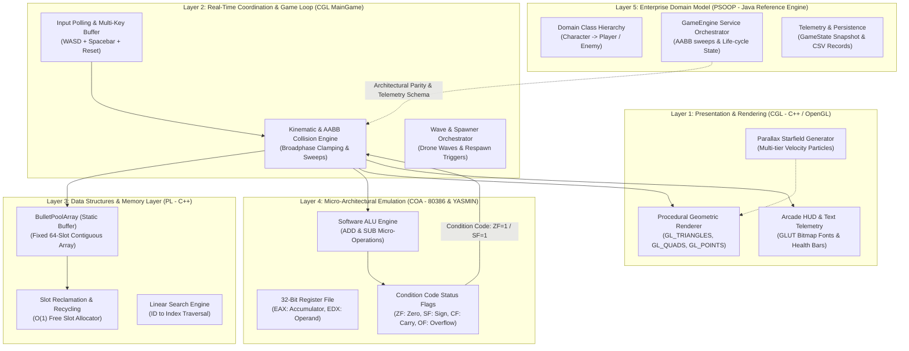
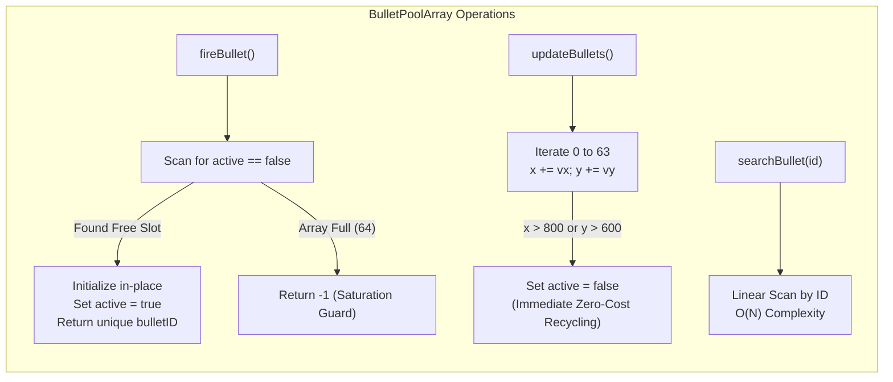
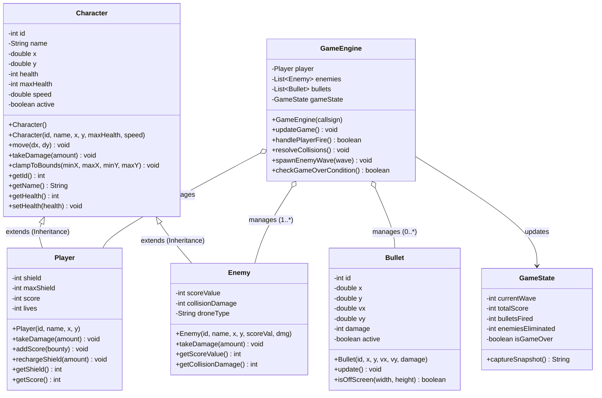
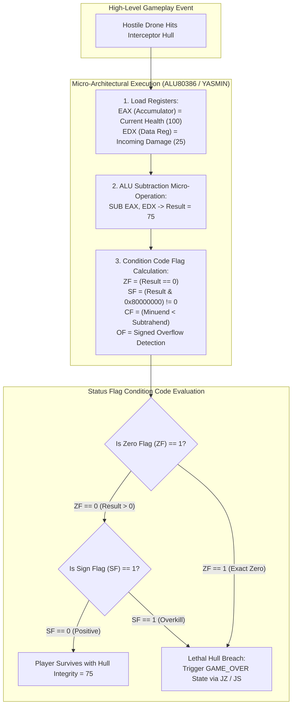
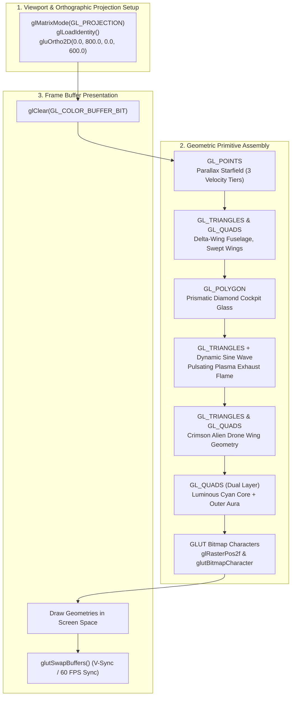
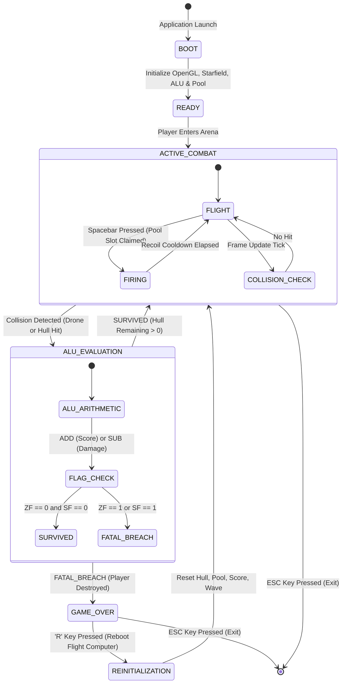

# AIRSTRIKER — SYSTEM ARCHITECTURE SPECIFICATION

```
================================================================================
                    AIRSTRIKER: 2D SPACE SHOOTER
           COLLEGE INTEGRATED ENGINEERING CAPSTONE PROJECT
                  FOUR-SUBJECT ARCHITECTURE SPECIFICATION
================================================================================
```

> **Document Status:** Official System Architecture Document  
> **Target Audience:** Evaluators, Academic Faculty, Software Engineers, AI Pair-Programmers  
> **Technologies:** C++11, Java (JDK 26), YASMIN CPU-OS Simulator / 80386 ALP, OpenGL / GLUT  
> **Milestone Alignment:** Complete for CO-1 Baseline; Architecturally Prepared for CO-2 through CO-6  

---

## 1. Executive Architectural Summary

**AirStriker** is an academic desktop 2D side-scrolling space shooter engineered to visibly demonstrate core computer science principles across four foundational curriculum subjects:
1. **Programming Lab / Data Structures (PL - C++):** Deterministic memory pooling, cache-friendly array traversals, $O(1)$ allocation/recycling.
2. **Problem Solving using OOP (PSOOP - Java):** Object-oriented domain modeling, strict encapsulation, inheritance hierarchies, and decoupled service orchestration.
3. **Computer Organization & Architecture (COA - YASMIN & 80386):** Hardware-software co-design, micro-operations, register files, and condition code status flags directly driving gameplay states.
4. **Computer Graphics Lab (CGL - C++ / OpenGL):** Real-time procedural geometric rendering, 2D orthographic projection, double-buffered frame synchronization, and 60 FPS animation.

Unlike standard hobbyist game projects that rely on heavy prebuilt engines (e.g., Unity, Godot, Pygame), AirStriker implements its own systems from first principles, establishing a transparent mapping between high-level gameplay actions and low-level computer architecture.

---

## 2. High-Level Multi-Tier System Topology

The system is organized into four interconnected functional layers, creating a clean separation of concerns between presentation, spatial domain logic, low-level data structures, and micro-architectural CPU simulation.



---

## 3. Real-Time 60 FPS Game Loop Lifecycle

The central game loop executes at a deterministic 60 frames per second (16.67 ms frame budget) managed via `glutTimerFunc`. Each iteration follows a strict synchronous execution lifecycle:

```mermaid
sequenceDiagram
    autonumber
    actor User as Player
    participant Input as Input Manager
    participant Loop as MainGame Loop
    participant PL as BulletPoolArray (PL)
    participant Physics as Collision Sweep
    participant COA as ALU 80386 (COA)
    participant CGL as OpenGL Renderer (CGL)

    User->>Input: Press Key (W/A/S/D / Space)
    Input->>Loop: Update Input State Buffer
    Loop->>Loop: Update Player Coordinates (Clamped to Screen)
    
    alt Spacebar Pressed & Cooldown Elapsed
        Loop->>PL: fireBullet(x, y, vx, vy, damage)
        PL->>PL: Claim First Inactive Array Slot [O(1)]
        PL-->>Loop: Return Assigned Bullet ID
    end

    Loop->>PL: updateBullets(bounds)
    PL->>PL: Iterate Contiguous Array & Deactivate Off-screen

    Loop->>Physics: Perform AABB Collision Checks (Bullets vs Enemies)
    
    alt Bullet Hits Alien Drone
        Physics->>PL: deactivateBullet(bulletID)
        Physics->>COA: executeADD(EAX=Score, EDX=Bounty)
        COA->>COA: Update Flags (CF, OF, ZF)
        COA-->>Loop: Return New Score & Flag Status
    end

    alt Player Collides with Drone
        Physics->>COA: executeSUB(EAX=Health, EDX=Damage)
        COA->>COA: Update Flags (ZF=Zero, SF=Sign)
        COA-->>Loop: Return Remaining Health & Flag Status
        opt ZF == 1 or SF == 1
            Loop->>Loop: Trigger Fatal Hull Breach -> isGameOver = true
        end
    end

    Loop->>CGL: Clear Color & Depth Buffers
    Loop->>CGL: renderBackground(Starfield)
    Loop->>CGL: renderPlayerShip(x, y, size)
    Loop->>CGL: renderDrones(activeEnemies)
    Loop->>CGL: renderActiveBullets(bulletPool)
    Loop->>CGL: renderArcadeHUD(Score, Health, Wave, Flags)
    CGL->>User: glutSwapBuffers() (Display Frame)
```

---

## 4. Subsystem Architectural Blueprints

### 4.1 Programming Lab (PL) — Deterministic Memory Pool Architecture

In high-performance interactive graphics, allocating memory on the heap (`new` / `delete` or `malloc` / `free`) within the frame loop causes heap fragmentation and non-deterministic pause times. AirStriker solves this through a **Fixed-Size Static Array Pool**:

```
+-----------------------------------------------------------------------------+
|                          BulletPoolArray Memory Layout                      |
|                      Contiguous Buffer: Bullet[64] in RAM                   |
+-----------------------------------------------------------------------------+
| Slot 0  | ID: 101 | x: 250.4 | y: 300.0 | vx: 12.0 | vy: 0.0 | ACTIVE: true  |
| Slot 1  | ID: 102 | x: 410.2 | y: 300.0 | vx: 12.0 | vy: 0.0 | ACTIVE: true  |
| Slot 2  | ID: --- | x: 000.0 | y: 000.0 | vx: 00.0 | vy: 0.0 | ACTIVE: false | <--- Next free slot
| Slot 3  | ID: 104 | x: 720.8 | y: 150.0 | vx: 12.0 | vy: 0.0 | ACTIVE: true  |
| ...     | ...     | ...      | ...      | ...      | ...     | ...           |
| Slot 63 | ID: --- | x: 000.0 | y: 000.0 | vx: 00.0 | vy: 0.0 | ACTIVE: false |
+-----------------------------------------------------------------------------+
```



**Key Algorithmic Properties:**
- **Allocation Time:** $O(1)$ average when pool has free capacity; bounded $O(N)$ linear scan for available index.
- **Deallocation Time:** $O(1)$ direct index access or $O(N)$ linear search by ID.
- **Spatial Locality:** All bullets are packed in contiguous memory, maximizing L1/L2 data cache hit ratios during coordinate updates.
- **Zero Runtime Heap Allocation:** Zero calls to dynamic allocators during active gameplay.

---

### 4.2 Problem Solving using OOP (PSOOP) — Domain Hierarchy & Service Architecture

The Java subsystem encapsulates the object-oriented business domain model and service orchestration, establishing design patterns that ensure defensive programming and strong cohesion.



**OOP Principles Realized:**
- **Encapsulation:** All mutable attributes are declared `private`; access is controlled via validated accessor and mutator methods.
- **Polymorphism & Method Overriding:** `Player.takeDamage()` overrides `Character.takeDamage()` to implement layered shield absorption (shield absorbs hit before hull incurs damage).
- **Service-Model Separation:** `GameEngine` acts as an orchestration service, decoupling collision math and wave logic from raw entity data models.

---

### 4.3 Computer Organization & Architecture (COA) — Hardware-Software Co-Design

The COA module bridges high-level game logic directly with low-level micro-architecture. Score increments and hull damage are not computed using basic high-level arithmetic statements; they are processed through simulated 32-bit registers and an Arithmetic Logic Unit (ALU), with CPU status flags driving gameplay branch decisions.



#### Status Flag Mapping Matrix
| Micro-Operation | Assembly Mnemonic | Game Action | Monitored Status Flags | Gameplay Decision |
|---|---|---|---|---|
| **ADD EAX, EDX** | `ADD R00, R01` (YASMIN) | Destroy alien drone; add bounty to score | `CF` (Carry Flag), `OF` (Overflow) | Detects score wrap/overflow beyond 32-bit limit |
| **SUB EAX, EDX** | `SUB R00, R01` (YASMIN) | Ship sustains hostile laser / collision hit | `ZF` (Zero Flag) | `ZF = 1`: Exact fatal hull breach; triggers Game Over |
| **SUB EAX, EDX** | `SUB R00, R01` (YASMIN) | Massive overkill collision hit | `SF` (Sign Flag) | `SF = 1`: Negative hull integrity; triggers Game Over |
| **CMP EAX, EDX** | `CMP R00, R01` (YASMIN) | High-score comparison | `CF`, `ZF`, `SF` | Evaluates if current run surpasses leaderboard record |

---

### 4.4 Computer Graphics Lab (CGL) — Procedural OpenGL Graphics Pipeline

The CGL subsystem uses pure procedural geometric rendering without external bitmap images, enforcing mastery of computer graphics primitives and coordinate transformations.



---

## 5. System State Machine & Lifecycle Transitions

The overall game state transitions through well-defined operational modes governed by player actions, combat resolution, and ALU condition codes:



---

## 6. Cross-Platform Data Contract & Telemetry Persistence

To maintain architectural decoupling while enabling shared state verification across C++ and Java, AirStriker specifies standard data contracts for telemetry snapshots and player persistence:

### 6.1 State Telemetry Contract (`data/game_state.json`)
```json
{
  "timestamp": "2026-09-09T15:30:00Z",
  "engineVersion": "CO-1.0.0",
  "player": {
    "callsign": "Viper-1",
    "x": 100.0,
    "y": 300.0,
    "health": 100,
    "maxHealth": 100,
    "shield": 50,
    "score": 1500,
    "alive": true
  },
  "subsystems": {
    "pl_bullet_pool": {
      "totalCapacity": 64,
      "activeBullets": 3,
      "totalFired": 24
    },
    "coa_alu": {
      "register_eax": "0x0000004B",
      "register_edx": "0x00000019",
      "flag_zf": false,
      "flag_sf": false,
      "flag_cf": false
    },
    "cgl_renderer": {
      "targetFPS": 60,
      "starCount": 90,
      "resolution": "800x600"
    }
  }
}
```

### 6.2 High-Score Leaderboard Contract (`data/leaderboard.csv`)
```csv
rank,callsign,score,wave,bullets_fired,accuracy_pct,completion_date
1,Viper-1,14250,5,310,78.4,2026-09-08
2,StarLord,11800,4,285,71.2,2026-09-08
3,EchoPilot,8950,3,190,65.0,2026-09-07
```

---

## 7. Course Outcome (CO) Architectural Roadmap

| Milestone | Subject | Architectural Enhancement Planned |
|---|---|---|
| **CO-1 [CURRENT]** | All 4 | Foundation: Fixed Bullet Pool (`BulletPoolArray`), 80386 ALU emulation + YASMIN ALPs, procedural ship/drone rendering, 60 FPS loop. |
| **CO-2 [NEXT]** | **PL:** 2D Grid Matrix<br/>**PSOOP:** Full Subclass Hierarchy (`Drone`, `Fighter`, `Boss`)<br/>**COA:** Instruction Cycle State Machine (`Fetch -> Decode -> Execute`)<br/>**CGL:** Bresenham Line & Circle algorithms for targeting reticles and radar |
| **CO-3** | **PL:** Singly & Doubly Linked Lists<br/>**PSOOP:** Abstract Classes & Interfaces (`Movable`, `Collidable`)<br/>**COA:** 64-bit Arithmetic Emulation<br/>**CGL:** Scan-line Polygon Fill & Spark Particle Systems |
| **CO-4** | **PL:** Circular Linked List & Circular Queue<br/>**PSOOP:** Custom Exceptions (`WeaponOverheatException`)<br/>**COA:** Multiplication Hardware Emulation (Combos)<br/>**CGL:** 2D Affine Matrix Transformations (Rotation, Scale) |
| **CO-5** | **PL:** Binary Search & Sorting Algorithms (QuickSort)<br/>**PSOOP:** Generic Repositories (`Repository<T>`) & File I/O<br/>**COA:** Hex-to-BCD Conversion for Electronic Scoreboard<br/>**CGL:** Cohen-Sutherland 2D Clipping |
| **CO-6** | All 4 | Unified Integrated Release Build: Start Menu -> Wave Combat -> Boss Arena -> High-Score Sorting -> Data Persistence. |

---

## 8. Architectural Integrity Verification Checklist

Every component and future addition must comply with the following structural rules:
1. **Memory Discipline:** No dynamic allocation (`new` / `malloc`) within the active 60 FPS game loop. All dynamic entities must use contiguous pools.
2. **Defensive Encapsulation:** All Java domain fields must remain private with defensive validation on setters.
3. **Genuine Micro-Operations:** High-level score and damage operations must call the simulated ALU and update CPU flags; no dummy bypasses.
4. **Procedural Graphics:** No third-party game engines or external bitmap sprites; all geometry is assembled procedurally from native OpenGL primitives.
