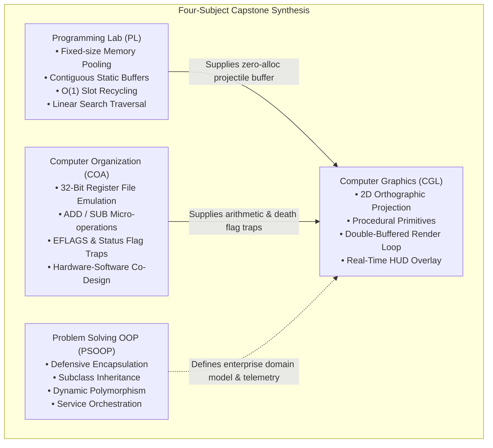

# AIRSTRIKER — DETAILED SYSTEM ARCHITECTURE BLUEPRINT

```
================================================================================
               COLLEGE INTEGRATED ENGINEERING CAPSTONE PROJECT
                  DETAILED SYSTEM ARCHITECTURE BLUEPRINT
================================================================================
```

## 1. Academic System Context & Curriculum Integration

The **AirStriker** system architecture is designed to satisfy the rigorous technical requirements of a four-subject integrated computer engineering capstone project. Rather than treating each academic subject as an isolated coursework assignment, the system synthesizes them into a unified, co-dependent software architecture.



---

## 2. Layered Architectural Decomposition

The runtime engine implements a strict multi-tier hierarchy where higher layers consume services from lower layers without introducing cyclic dependencies.

```
+---------------------------------------------------------------------------------+
| Layer 4: PRESENTATION LAYER (CGL - C++ / Native OpenGL / GLUT)                 |
| - 2D Orthographic Viewport (gluOrtho2D [0, 800] x [0, 600])                     |
| - Double-buffered Frame Presentation (glutSwapBuffers)                          |
| - Procedural Primitive Generators (GL_TRIANGLES, GL_QUADS, GL_POLYGON, GL_POINTS)|
| - Real-time HUD Bitmaps (glutBitmapCharacter)                                  |
+---------------------------------------------------------------------------------+
                                      ^
                                      | Renders state & geometry
                                      |
+---------------------------------------------------------------------------------+
| Layer 3: GAMEPLAY COORDINATION & INPUT LAYER (CGL MainGame.cpp)                 |
| - 60 FPS Synchronous Frame Loop (glutTimerFunc at 16.67 ms)                     |
| - Dual Keyboard Polling Buffers (Normal ASCII keys & GLUT Special Keys)         |
| - Kinematic Integration (Euler method: pos += vel * dt)                        |
| - AABB (Axis-Aligned Bounding Box) Sweeps & Collision Detection                 |
| - Dynamic Wave Spawning & Enemy State Progression                               |
+---------------------------------------------------------------------------------+
                   |                                             |
   Consumes Memory |                                             | Dispatches Micro-ops
   Pooling Buffer  |                                             | & Evaluates Flags
                   v                                             v
+------------------------------------+       +------------------------------------+
| Layer 2: DATA STRUCTURES & MEMORY  |       | Layer 1: MICRO-ARCHITECTURAL ALU   |
| (PL - C++)                         |       | (COA - C++ / 80386 & YASMIN ALP)   |
| - Static Bullet Pool (64 slots)    |       | - Register File (EAX, EBX, ECX, EDX|
| - O(1) Allocation & Recycling      |       | - ALU ADD/SUB Micro-operations     |
| - Linear Search by Bullet ID       |       | - Status Flags (ZF, SF, CF, OF)    |
| - Zero Runtime Heap Allocations    |       | - JZ / JS Conditional Death Traps  |
+------------------------------------+       +------------------------------------+
                   ^                                             ^
                   |                                             |
+---------------------------------------------------------------------------------+
| Layer 0: SHARED TELEMETRY & DOMAIN MODEL CONTRACT (PSOOP & Shared Data)         |
| - Entity Blueprints (Character, Player, Enemy, Bullet)                         |
| - JSON Telemetry Snapshot Schema (data/game_state.json)                         |
| - CSV Leaderboard Persistence (data/leaderboard.csv)                            |
+---------------------------------------------------------------------------------+
```

---

## 3. Coordinate System & Projection Architecture

The graphics subsystem operates on an exact pixel-mapped **2D Cartesian coordinate system**:

- **Resolution:** 800 horizontal pixels $\times$ 600 vertical pixels.
- **Origin $(0, 0)$:** Bottom-Left corner of the screen (OpenGL standard convention).
- **Upper-Right Bound $(800, 600)$:** Top-Right corner of the display.
- **Player Start Coordinates:** $(X=100.0, Y=300.0)$, centered vertically on the left third of the screen.
- **Projection Matrix:**
  $$\begin{bmatrix} X_{clip} \\ Y_{clip} \\ Z_{clip} \\ W_{clip} \end{bmatrix} = \begin{bmatrix} \frac{2}{800} & 0 & 0 & -1 \\ 0 & \frac{2}{600} & 0 & -1 \\ 0 & 0 & -1 & 0 \\ 0 & 0 & 0 & 1 \end{bmatrix} \begin{bmatrix} X_{world} \\ Y_{world} \\ 0 \\ 1 \end{bmatrix}$$
- **Screen Clamping Logic:**
  $$X_{player} \leftarrow \max(30.0, \min(770.0, X_{player}))$$
  $$Y_{player} \leftarrow \max(25.0, \min(575.0, Y_{player}))$$

---

## 4. Memory Model & Complexity Analysis

### 4.1 Static Memory Allocation Strategy
In traditional dynamic architectures, bullets are allocated with `new Bullet()` and released with `delete`. In an arcade shooter running at 60 FPS, this creates severe memory fragmentation and triggers CPU cache misses due to scattered pointer addresses.

AirStriker enforces **Deterministic Static Allocation**:
- **Fixed Capacity:** `MAX_BULLETS = 64`.
- **Memory Footprint:** 
  $$\text{Size of Bullet struct} = 4 \text{ bytes (ID)} + 16 \text{ bytes (4 floats)} + 4 \text{ bytes (damage)} + 1 \text{ byte (active)} + 3 \text{ bytes padding} = 28 \text{ bytes}$$
  $$\text{Total Pool Size} = 64 \times 28 \text{ bytes} = 1,792 \text{ bytes } (\approx 1.75 \text{ KB})$$
- The entire bullet pool easily fits inside the CPU's **L1 Data Cache** (typically 32 KB to 48 KB per core), allowing the update loop to traverse bullets with maximum cache efficiency.

### 4.2 Complexity Profile
| Operation | Subsystem | Best Case | Average Case | Worst Case | Space Complexity |
|---|---|---|---|---|---|
| **Bullet Allocation (`fireBullet`)** | PL | $O(1)$ | $O(1)$ | $O(N)$ ($N=64$) | $O(1)$ |
| **Bullet Update & Cull (`updateBullets`)**| PL | $O(N)$ | $O(N)$ | $O(N)$ ($N=64$) | $O(1)$ |
| **Bullet Search (`searchBullet`)** | PL | $O(1)$ | $O(N)$ | $O(N)$ ($N=64$) | $O(1)$ |
| **Collision Sweep (Broadphase + AABB)** | MainGame | $O(M \times K)$ | $O(M \times K)$ | $O(M \times K)$ | $O(1)$ |
| **ALU Micro-operation (`executeADD/SUB`)**| COA | $O(1)$ | $O(1)$ | $O(1)$ | $O(1)$ |
| **Geometric Primitive Rasterization** | CGL | $O(V)$ | $O(V)$ | $O(V)$ ($V \approx 200$) | $O(1)$ |

*(Where $N = \text{bullet pool capacity (64)}$, $M = \text{active bullets}$, $K = \text{active enemies}$, $V = \text{total primitive vertices})$.*

---

## 5. Hardware-Software Co-Design & Micro-Architectural Binding

A central innovation of this architecture is the direct hardware-software co-design binding between high-level game logic and low-level CPU flags:

```mermaid
sequenceDiagram
    participant Game as Game Loop
    participant ALU as Simulated ALU (80386)
    participant EFLAGS as Status Register (EFLAGS)
    participant Branch as Control Unit Branch

    Note over Game,Branch: Collision Detected: Enemy Drone Collides with Player
    Game->>ALU: setEAX(playerHealth = 25)
    Game->>ALU: setEDX(droneDamage = 25)
    Game->>ALU: executeSUB()
    ALU->>ALU: Result = 25 - 25 = 0
    ALU->>EFLAGS: Compute ZF: Result == 0 ? 1 : 0 (ZF = 1)
    ALU->>EFLAGS: Compute SF: (Result & 0x80000000) != 0 ? 1 : 0 (SF = 0)
    ALU->>EFLAGS: Compute CF: Unsigned Borrow ? 1 : 0 (CF = 0)
    ALU-->>Game: Return Result = 0

    Game->>ALU: getZF()
    ALU->>EFLAGS: Read Bit 6
    EFLAGS-->>Game: true (ZF == 1)

    alt ZF == 1 (Zero Flag Set)
        Game->>Branch: JZ lethal_breach_handler
        Branch-->>Game: Set isGameOver = true; Trigger Explosions; Show Game Over HUD
    else ZF == 0 and SF == 0
        Game->>Game: Ship survives hit; update health gauge
    end
```

### Mathematical Formulation of Flag Updates in `ALU80386`:
1. **Zero Flag (ZF):**
   $$\text{ZF} = \begin{cases} 1 & \text{if } \text{Result} = 0 \\ 0 & \text{otherwise} \end{cases}$$
2. **Sign Flag (SF):**
   $$\text{SF} = \begin{cases} 1 & \text{if } (\text{Result} \ \& \ \text{0x80000000}) \neq 0 \\ 0 & \text{otherwise} \end{cases}$$
3. **Carry Flag on Addition (CF):**
   $$\text{CF}_{\text{ADD}} = \begin{cases} 1 & \text{if } \text{Result} < \text{EAX} \\ 0 & \text{otherwise} \end{cases}$$
4. **Carry Flag on Subtraction / Borrow (CF):**
   $$\text{CF}_{\text{SUB}} = \begin{cases} 1 & \text{if } \text{EAX} < \text{EDX} \\ 0 & \text{otherwise} \end{cases}$$
5. **Overflow Flag on Subtraction (OF):**
   $$\text{OF} = \begin{cases} 1 & \text{if } ((\text{EAX} \oplus \text{EDX}) \ \& \ (\text{EAX} \oplus \text{Result}) \ \& \ \text{0x80000000}) \neq 0 \\ 0 & \text{otherwise} \end{cases}$$

---

## 6. Single-Threaded Deterministic Execution Architecture

The game runtime utilizes a single-threaded, event-driven deterministic execution model:
- **Zero Race Conditions:** Because all systems (Input, Kinematics, Collision, ALU, Graphics) run synchronously within the single OpenGL/GLUT UI thread, there are zero thread synchronization primitives (`mutex`, `semaphore`), eliminating deadlocks and race conditions.
- **Deterministic Frame Pacing:** `glutTimerFunc(FRAME_DELAY_MS, timerCallback, 0)` ensures consistent 60 Hz frame callbacks.
- **Input Responsiveness:** Keydown and keyup events modify an unlatched boolean array (`keys[256]`), providing instantaneous multi-key rollover (e.g., flying diagonally with `W+D` while firing with `Space`).

---

## 7. Fault Tolerance & Safety Boundaries

The architecture guarantees stability through multiple defensive layers:
1. **Pool Saturation Safety:** If the player fires when all 64 bullet slots are occupied, `fireBullet` gracefully returns `-1`. The request is dropped without crashes, memory leaks, or buffer overruns.
2. **Screen Clamping Bounds:** Player coordinates are clamped every frame to prevent the ship from moving outside the viewport or off-screen memory limits.
3. **Integer Underflow Guards:** Subtraction in the ALU uses explicit 32-bit unsigned wrappers with borrow flag detection, preventing unhandled runtime exceptions.
4. **Defensive Validation in Domain Model:** The Java domain models enforce strict parameter boundaries (`health >= 0`, `speed >= 0`, `callsign != null && callsign.length() >= 2`).
